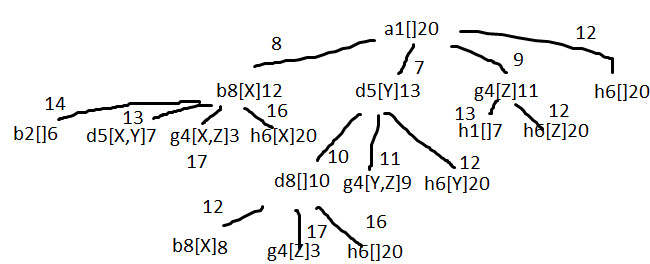

# EN - 2018

## 1

1 -

2 - h1 is admissible, because the robot always needs to move at least one cell per object, underestimating by a lot the
cost. h2 is admissible, because the robot always needs to move at least one cell per object, even fot those that already
are in the robot. h3 is not admissible because if the map has two final points next to each other it will overestimate
the cost, eg R[X,Y] _ _ Y X, the h3 cost will be 3+4=7 but the actual cost is 4. h4 is admissible, it will underestimate
the cost until the last object, where it will equal it.

3 - h4 is the closest to the real valuee

## 2

1 -[M1,M3,M2,M3,M3]

2 -

3 -

4 -

## 3

1 -

2 -

## 4

1 - 