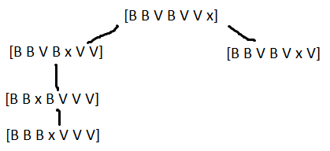
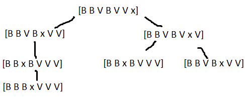

# EN - 2019

## 1

1 -

- State: List with ints, 1 being White and 0 being Red and -1 being Empty, eg. [0,0,0,-1,1,1,1];
- Initial State: [0,0,0,-1,1,1,1];
- Objective State: [1,1,1,-1,0,0,0];
- Operands:
    - Restrictions: Red pieces can only move to the right and Whites to the left;
    - M1: Move a piece to an Empty square (Cost: 1);
    - M2: Move over a Piece to an Empty square (Cost: 2);
    - M3: Move over two Pieces to an Empty Square (Cost: 2);

2 - h1 is always admissible, because it never overestimates the value of the optimal solution. h2 is not admissible,
e.g. [1,1,1,0,-1,0,0] only has a cost of 1 to reach the solution but with this heuristic the cost will be greater. h3 is
admissible, because it never overestimates the value of the optimal solution. For example, in the initial state
presented, the cost with this heuristic will be 6, but in reality there will be more than 6 moves needed. In the final
states, e.g. [1,1,1,0,-1,0,0], the cost of this heuristic will be 0 when in reality is 1.

3 -

Calculate the distance to the closest objective square. The distance never over calculates the cost of the solution.

````python
# Count the number of red pieces
def heuristic(state):
    h = 0
    for i in range(0, 7):
        if state[i] == V:
            h += max(0, 4 - i)
        elif state[i] == B:
            h += max(0, i - 2)

    return h
````

4 -




## 2

1 - Positions : (x,y)
Cost: Manhattan distance between two points Solution:  [2,4,3,1,5,6], where each integer is the number associated to a
client's location

````python
def evaluate(sol):
    score = 0
    for i in range(1, len(sol)):
        score += manhattan(sol[i - 1], sol[i])
    score += manhattan(fab1, sol[0]) + manhattan(sol[len(sol) - 1], fab2)
    return score
````

2 -

Trade two numbers in the list

````python
def nearest(sol):
    n_sol = sol
    first, second = random(0, len(sol)), random(0, len(sol))
    while (first == second):
        first, second = random(0, len(sol)), random(0, len(sol))

    n_sol[first] = sol[second]
    n_sol[second] = sol[first]

    return n_sol
````

3 -

````python

def hill_climbing(fab, cli):
    state = []
    for i in range(0, 6):
        randomNum = []
        while True:
            randomNum = round(random() * 5)
            if state.includes(randomNum):
                continue
            state.push(randomNum)
            break

    for i in range(0, 100):
        new = new_random_state(state)
        if eval(new, fab, cli) < eval(state, fab, cli):
            state = new
            i = 0
````

4 -

## 3

1 -

Yes, because this game has a reduced amount of possible states. So a simple reflexive agent would be a quick way to
solve. To implement this agent it would be needed the best move from the actual state, this actual state would be
represented by the position of the pieces in the board and its owners.

2 -

Both algorithms guarantee an optimal solution. A* guarantees if the heuristic is admissible, as is the case. Since every
solution will have a different cost, there will only be an optimal solution. Therefore, both algorithms will find the
same solution.

3 - a) C, if the last one was B b) E, if the last one was B c) D, it's the node with less cost, g=3 d) C, it's the node
with less heuristic cost, h=1 e) G, it's the node with less cost overall, 3+5+2=10

4 - The ordering of the nodes impacts the efficiency of the algorithm. If the nodes are in the worst possible ordering,
there will be no cuts.

5 - a) A = 8, B = 3, C <=1 , D=8 b) O,Q,T,U,Y

6 - a) Since the value is lower than the previous one, and we want to maximize, the probability of being accepted is: e^((new-prev)/T) = 10,8%
b) Since the value is lower than the previous one, and we want to minimize, the value is accepted.

7 - 

16 -

17 - 