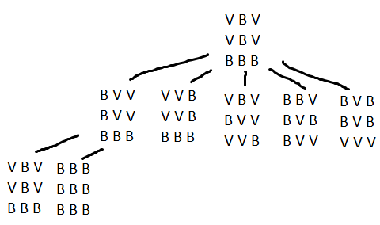

# EN - 2020

## 1

1 -

- State: List if lists, 1 being White and 0 being Red, eg. [[0,1,0],[0,1,0],[1,1,1]];
- Initial State: [[0,1,0],[0,1,0],[1,1,1]];
- Objective State: [[1,1,1],[1,1,1],[1,1,1]];
- Operands:
    - No pre-conditions for the operands;
    - ALL: Invert the whole board;
    - TL: Invert top left square;
    - TR: Invert top right square;
    - BL: Invert bottom left square;
    - TL: Invert bottom right square;

- Cost function: Number of inverted pieces;

2 - Each state has 5 ramifications, therefore, its average ramification will be 5. Since each cell can have 2 value and
there are 9 cells, there will be 2^9=512 possible states.

3 - 

BFS would have expanded all nodes of level 1, before finding the solution. DFS only expands the first node.

4 - Counting the number of red pieces. It is admissible because it never overestimates the cost of getting to the
solution, since we have to invert the red pieces

````python
# Count the number of red pieces
def heuristic(state):
    count = 0
    for line in state:
        for cell in line:
            if cell == 0:
                count += 1
    return count
````

## 2

1 - Input file:

````text
7 %Locations
3 3 %Coordinates (x,y)
8 8
20 10
0 0
41 26
81 15
47 20
````

Solution:
List of lists: First brigade, second brigade, not visited

````python
[[4, 1, 2, 3, 5], [7, 6], []]
````

2 - The time is the strong restriction (8h). The optimization criteria is the number of visited locations. A solution is
evaluated by the number of locations visited.

````python
def evaluate(sol):
    cont = 0
    time = 0
    for i in range(0, 2):
        for location in range(1, len(sol[i])):
            cont += 5
            time += manhattanh_dist(sol[i][location - 1], sol[i][location]) + 1

    return 0 if time > 8 else time + cont
````

3 -

Result 1: 3+2+1.5=7

Result 2: 2.5+2+1.5=6

4 -

Choose a number between 0 and 2:

- if 0 , remove an element from a brigade and put it in the non visited list;
- if 1, remove an element from the non visited list and add to a brigade;
- if 2, switch two elements between brigades;

# 3

9 -

10 -

a - A = 10; B = 2; C = 10; D <=5 b - O, U, X e Y

11 - The phrase is true. Since complex games can have a large amount of ramifications. Minimax algorithm is continuously
looking for the best move to play, therefore if we implement a timeout in the algorithm, we will get the best possible
solution in util time.

12 -

````python
init = first_sol()

for i in range(1, 1501):
    T = 0 if i > 1000 else T = 1.0 - i / 1000
    n = randomN(init)
    dif = evaluate(n) - evaluate(init)
    init = n if (dif < 0) or (random(0, 1) < e ^ (dif / T)) else init = init
````

13 -

14 -

15 -

16 -

17 - 