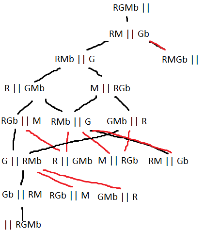
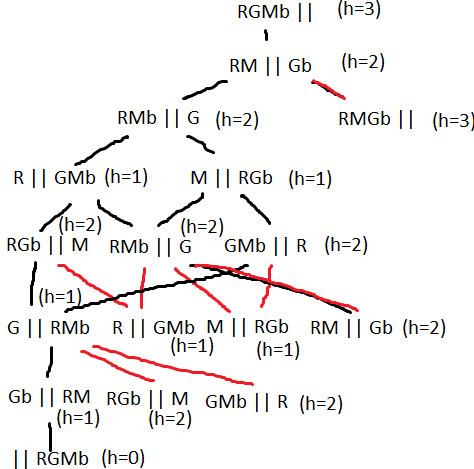
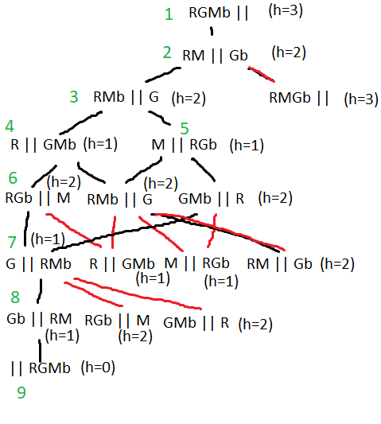
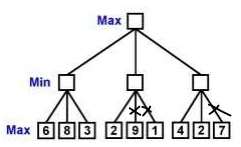

# ER - 2018

## 1

1 -

2 - How many elements are on the left side, it is always admissible since there will be at least one move to place an
object on the right side.

3 - 

## 2

1 - Cost = max(M1,M2) = max(10+7+8=25,11+12=23) = 25

2 - {A-M2, B-M1, C-M2, D-M2, E-M1} = 33; {A-M1, B-M3, C-M2, D-M2, E-M1}=23; {A-M1, B-M1, C-M3, D-M2, E-M1}=25; {A-M1,
B-M1, C-M2, D-M3, E-M1}=25; {A-M1, B-M1, C-M2, D-M2, E-M2}=31; {A-M1, B-M1, C-M2, D-M2, E-M3}=23

Either the second or the last son, will be chosen

3 - Simulated annealing will first generate the first son. Since its value is worse than the initial solution, p = e^((
25-33)/10)=0.449 < 0.55 , so it will be rejected. The second son is immediately accepted, since its value is better than
the previous.

## 3

1 -

2 -

3 -

## 4

1 - DFS with limited depth, since optimality is not a required factor and we know the max depth of the solution. It also
requires less memory, being good for problems with large ramifications.

2 - h' = 0.9*h

3 -

4 - p(C1) = 10 / 82 = 12,2% p(C2) = 15 / 82 = 18,3% p(C3) = 27/82 = 32,9% p(C4)=30/82=36,6%

5 - 

6 - Causality, since the agent knows the environment.

7 - 