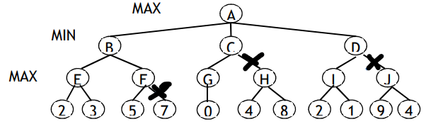

# ER2 - 2018

## 1

1 - i: I-A-B-C-F1-E (I-A-F1); ii: I-A-B-C-H-F3 (I-C-F3); iii: I-A-B-C-H-D-F2 (I-B-H-D-F2)

2 - Yes, the value is always inferior to that of the real cost

3 -

## 2

1 - [E,P,E,C,E]

2 - 700 - Soma dos custos - 100*nº de zonas adjacentes com a mesma espécie
[E,P,E,C,E] = 90; [E,P,E,P,E] = 110; [P,E,C,E,C] = 80; [C,P,E,P,E] = 70;

3 - 90+110+80+70 = 350 p(i) = 90/350 = [0, 0.257]
p(ii)=110/350 = ]0.257, 0.571]
p(iii)=31/350= ]0.571, 0.800]
p(iv)=41/350 = ]0.800, 1.000]

Selects i (of i,iii), since it has the higher value.

4 - Cross in the middle, i mantains, ii crossover, iv mantains, i crossover

After crossover: i, i+ii = [E,P,E,P,E], ii+i=[E,P,E,C,E]; iv

## 3

1 -

2 -

3 -

## 4

1 - False, not if the tree has several solutions

2 - Simulated annealing can select a "worse" state, depending on a probability that decreases over time.
This way, in the beginning, there is a higher probability of choosing a worse solution.

3 - 

4 - 

5 -

6 -

7 - 