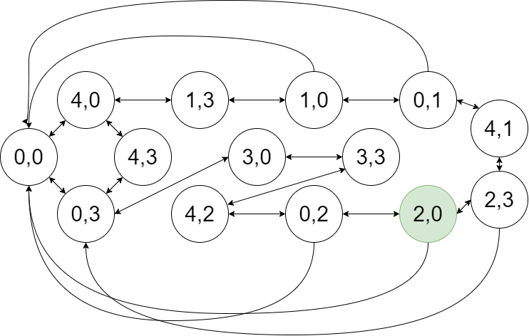

# Bucket Problem (E.g. 2)

## State Representation

## Initial State

0,0

## Operators

- Fill (completely) a bucket
- Empty a bucket.
- Pour one bucket into the other (until the second
one is full or until the first one is empty).

## Objective Test

First bucket contains **n** litres
