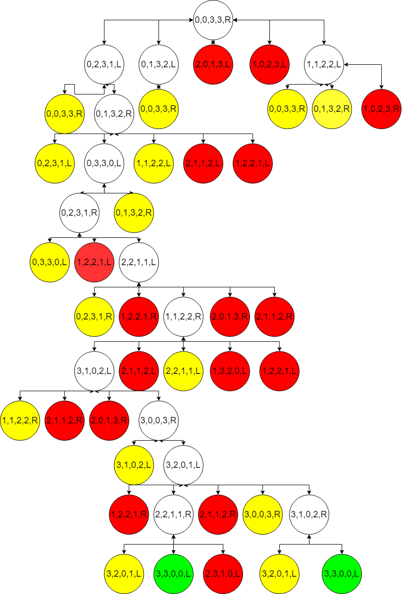

# Bucket Problem (E.g. 2)

## State Representation

## Initial State

0,0,3,3,right

## Operators

- Transfer people, must be 1 or 2 people, NEVER 0
- Transfer Missionary/ies, must have more missionaries than cannibals at that side;
- Transfer Cannibals

## Objective Test

Everyone crosses to the left
